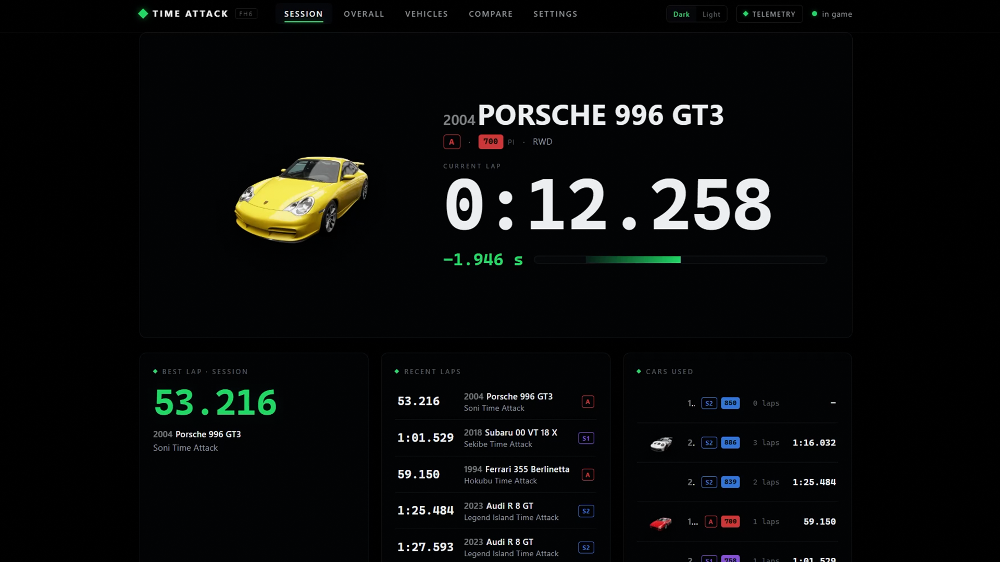
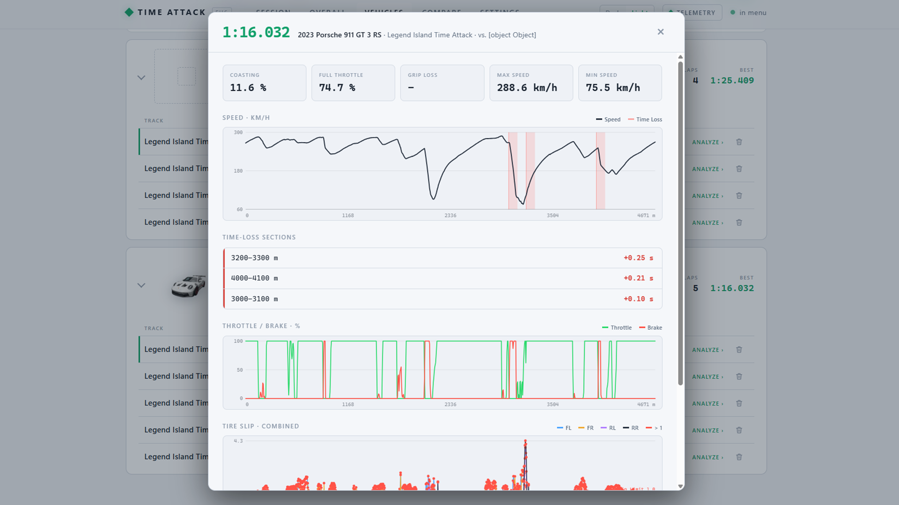
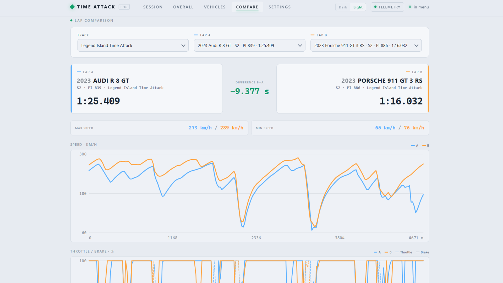
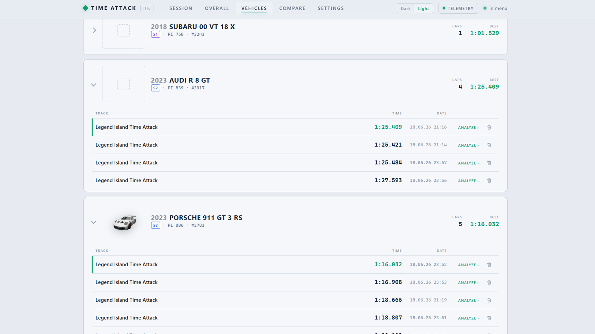
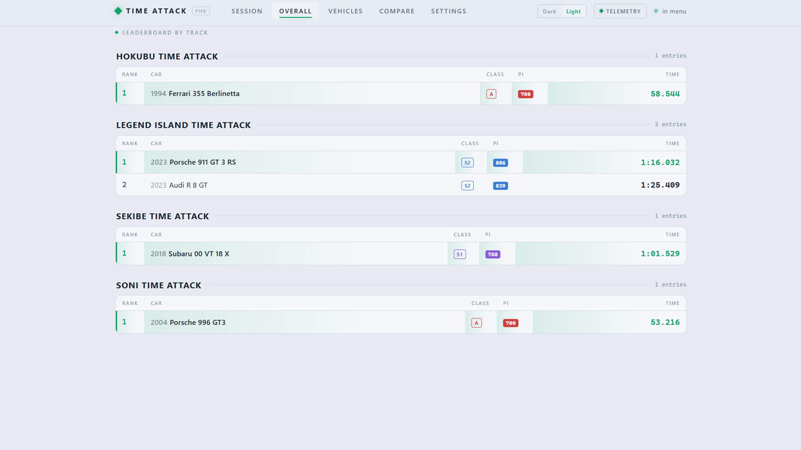
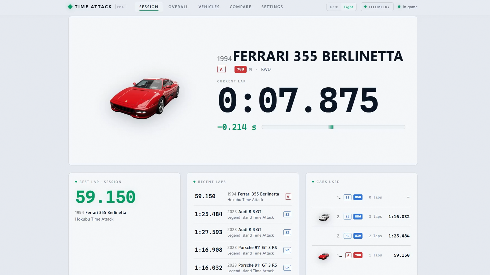

# FH6 Time Attack Lap Tracker

A lightweight tool that **automatically records your lap times on the open‑world
Time Attack circuits in Forza Horizon 6** and shows them on a clean local
dashboard — with live telemetry and per‑lap analysis.

Forza Horizon 6 does **not** send the Time Attack lap time over "Data Out", so
this tool measures laps itself from your position (a GPS stopwatch): it knows
each circuit's start/finish line and times every flying lap automatically — no
learning lap, works across car changes.

> **Read‑only.** The tool only *receives* the telemetry packets the game already
> broadcasts to your own PC. It never reads or writes game memory and sends no
> game or personal data anywhere — anti‑cheat‑safe. Your data stays local. (The
> only network request is a quick version check to GitHub on startup; see Privacy.)
>
> **Status: in active development** — feedback and feature wishes very welcome!

## Screenshots

**Demo** — a quick look at the live dashboard, lap analysis and telemetry:

https://github.com/user-attachments/assets/76979345-0105-4dce-a057-70502e586234

**Live session** (dark theme): current car, running lap timer and live delta vs. your best lap.



| Per‑lap analysis | Compare cars / tunings |
| --- | --- |
|  |  |

| Vehicles & times | Overall best times |
| --- | --- |
|  |  |

**Light theme**



## Download & run

1. Download `FH6 Lap Tracker.exe` from the latest [release](https://github.com/t1moleh/Forza-Horizon-6-Time-Attack-Tracker/releases/latest).
2. In Forza Horizon 6: **Settings → HUD → Data Out = ON**, IP `127.0.0.1`,
   Port `5300`.
3. Double‑click the `.exe`. The dashboard opens in **its own app window** — no
   console window.
4. Drive a Time Attack circuit, times appear automatically. Close the window to
   stop.

No Python needed. Your lap times and settings are stored in
`%APPDATA%\FH6LapTracker` (alongside a `fh6laptracker.log` for troubleshooting),
so they **survive updates** — you can replace or move
the `.exe` and all your recorded times stay intact. (Data from older versions
that kept files next to the `.exe` is migrated there automatically on first run.)

### A Windows warning may pop up — that's normal

Because this is a small free tool, the `.exe` isn't code‑signed (a certificate is
a paid, ongoing cost), so Windows may warn you the first time you run it:

- **SmartScreen** ("Windows protected your PC" / *unknown publisher*) — click
  **More info → Run anyway**.
- **Smart App Control** (a stricter Windows 11 feature that is off for most
  people) may block it outright. If you have it on, you can build the `.exe`
  yourself from the source, or run it on a machine without Smart App Control.

**Nothing to worry about:** the tool is **read‑only** (it only listens to the
telemetry your game already sends to your own PC) and the **full source code is
on GitHub**, so you can check exactly what it does or compile it yourself.

## Features

- **Automatic lap timing** on Time Attack circuits — flying laps, precise
  start/finish line crossing with time interpolation.
- **Instant circuit recognition** — known tracks are picked up by position; no
  learning lap, survives garage/car changes, auto‑switches between circuits.
- **Live dashboard** (local): current car, running lap timer, **live delta** vs.
  your best lap (green/red), session best, recent laps, cars used.
- **Telemetry pop‑up**: tyre temperatures, power, torque, throttle/brake (live).
- **Per‑lap analysis**: click a lap to see speed / throttle / brake / tyre‑slip
  charts, the sections where you lost the most time vs. your best lap, and
  concrete **improvement tips**.
- **Compare** two cars or tunings side by side.
- **Per car & tuning**: lap lists grouped by model + class + PI (different tunes
  show separately), an overall best‑times ranking per track, and **delete**
  individual laps.
- **Sound signals**: double‑beep at the finish, beep at the start, a chime on a
  personal best — configurable.
- **Dark and Light theme**.
- **Excel export** of all times.
- **German & English** UI.

## Included circuits

Comes pre‑calibrated for: **Legend Island, Hokubu, Soni, Sekibe** (Time Attack).
More can be added easily — record a lap, and the start/finish line is calibrated
from your driven line.

## Car images (optional)

The dashboard shows a cut‑out image of each car. Around 320 of the most common
cars are **built into the .exe**, so they just work. **More car images will be
added in future updates.** Missing ones show a clean placeholder, and you can
drop your own image onto a car in the UI to add it. The images are community
renders (source: labs.gg).

## A note on the times

The tool uses its own stopwatch (measured from your position), so a lap can
differ from the in‑game Time Attack timer by a few milliseconds. What matters is
that it always measures the same way, so every time you record sits on the same
basis. That makes it ideal for personal use: comparing cars, tunings and
sessions is fully consistent.

**Pause and rewind:** for valid times, drive your laps without pausing or using
rewind. If you pause (the game leaves the active session), the current lap is
discarded and timing simply re-arms when you next cross the start/finish line, so
no wrong time is recorded. Rewind, however, is not compensated yet: the stopwatch
keeps running, so a lap that includes a rewind gets an inflated, unreliable time.
Detecting and invalidating such laps automatically is planned for a later update.

## Privacy & fair play

The tool binds a local UDP socket and reads the "Data Out" packets the game sends
to `127.0.0.1`. It does not read or modify game memory, and it never sends your
lap times, telemetry or any personal data anywhere — that all stays on your PC.

The one exception is a **version check**: on startup the tool makes a single
read-only request to the public GitHub releases API to see whether a newer
version exists, and shows a small banner with a download link if so. It sends no
data of yours (just a normal HTTPS request, like opening a web page), uses no
account or API key, never auto-downloads anything, and silently does nothing if
you are offline.

## Feedback & bugs

Found a bug, missing a feature, or got an idea? I read every submission.

- **No account needed:** [send feedback / report a bug via the form](https://tally.so/r/Y5e55q)
  (about a minute, anonymous).
- Or open a **Bug report** / **Feature request** issue on GitHub.

## Roadmap

- More cut‑out car images (currently ~320 of the most common cars)
- More circuits / community‑contributed start/finish lines
- Automatic detection / invalidation of laps with rewind
- Whatever you suggest 🙂

## Build from source (developers)

```
py -m pip install -e ".[dev]"
py -m pytest                       # tests
py -m fh6tracker.tracker           # run live + dashboard
py -m fh6tracker.recorder          # record a calibration trace
cp -r cars/* web/cars/             # bundle car images into the build (web/cars)
py -m PyInstaller --onefile --noconfirm --clean --name "FH6 Lap Tracker" \
  --icon "icon.ico" --noconsole --collect-all webview \
  --add-data "web;web" --add-data "car_names.csv;." --add-data "circuits.csv;." \
  --add-data "car_meta.csv;." \
  fh6_tracker_app.py               # build the .exe (Windows)
```

## Disclaimer

Not affiliated with Microsoft, Turn 10 or Playground Games. "Forza Horizon" is a
trademark of Microsoft. Car names are from community data. License: MIT.
